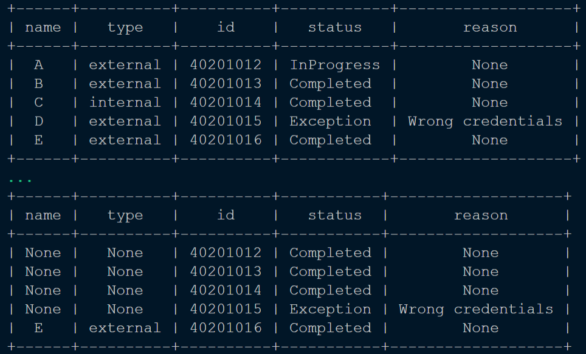

# Extended RPA.Excel.Files Robot

This Robot extends [RPA.Excel.Files](https://robocorp.com/docs/libraries/rpa-framework/rpa-excel-files) library with experimental
keywords like `Set Cells`, `Clear Cells` and `Print Sheet To Console`.

## Keyword `Set Cells`

Can be used to set value for a cell or range of cells using Excel's A1 notation.

## Keyword `Clear Cells`

Can be used to clear value for a cell or range of cells using Excel's A1 notation. By default keyword will set value of the cells to None, but
value can be set to EMPTY (space character).

## Keyword `Print Sheet To Console`

Uses keyword `Read Worksheet` to read Excel worksheet into memory and then prints its contents into the console and at the end returns the sheet.

## Learning materials

- [All docs related to Robot Framework](https://robocorp.com/docs/languages-and-frameworks/robot-framework)
